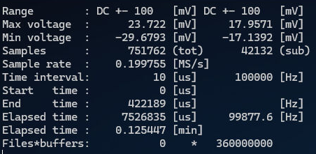

# 概要
Windows Visual Studio でコンパイル可能な、PicoScope 2000 Series の波形を取得・保存するためのシンプルなC++コード。RunFastStreaming プロジェクトが本体。

## 必要なもの
* PicoScope 2000 Series (試したのは2204Aのみ)
* [Visual Studio Community](https://visualstudio.microsoft.com/ja/vs/community/)
* [PicoScope driver / PicoSDK](https://www.picotech.com/downloads)
* [benhoyt/inih](https://github.com/benhoyt/inih)

## 設定パラメータ

exe と同じディレクトリに `config.ini` を置く。手元の環境で、サンプル間隔 10 us 以上でロスなしを確認している。

```ini
[General]
sample_interval_us = 10
output_data = true
buffers = 360000000
[ChannelA]
range = 100mV ; 50mV 100mV 200mV 500mV 1V 2V 5V 10V 20V
coupling = DC ; DC AC
[ChannelB]
range = 100mV ; 50mV 100mV 200mV 500mV 1V 2V 5V 10V 20V
coupling = DC ; DC AC
```

コンソール出力



出力ファイル形式は 16bit signed int のバイナリ形式。上記の設定パラメータ例の場合は、360000000サンプル分ごと(10μs毎なら1時間ごと)に1ファイル出力する。ADC値からmVに変換する関数は PicoStaticLib プロジェクトの関数 `adc2mV` を参照。

## PicoScope 7の画面
立ち上がり時間 0.5 us、波高 -66.3 mV、時定数 50 us のパルス信号を入れたときの例。


